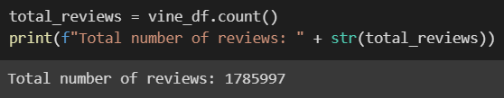
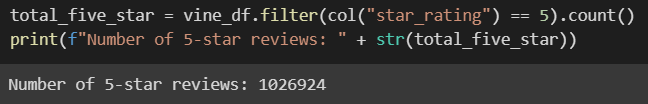
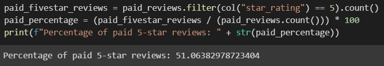
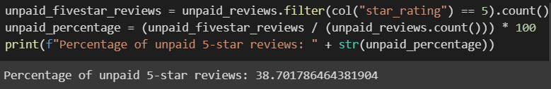

# Amazon Vine Analysis
## Overview of Project
Using S3 and PySpark, we were tasked with extracting Amazon review data of video games and performing analysis to determine any bias in the Vine review program. 
## Results
We began our project by creating a DataFrame to contain only the information relating to the reviews of games. With the Vine DataFrame, we were able to perform several analyses:
   * The total number of reviews:

   * The total number of 5-star reviews:

   * Percentage of paid 5-star reviews:

   * Percentage of unpaid 5-star reviews:

## Summary
Looking at the percentages of 5-star reviews, it does seem that getting paid to review video games results in an increased likelyhood that the games will receive a 5-star review. 
